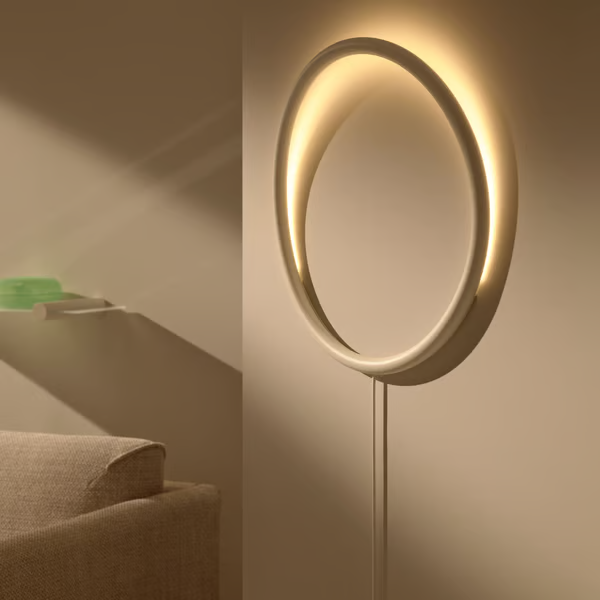
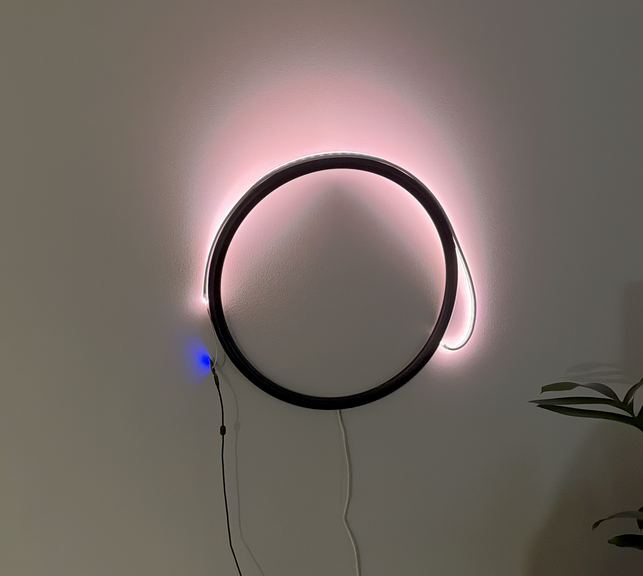

One day I was strolling through IKEA and stumbled upon VARMBLIXT wall lamp. I found the design intriguing and thought it would complement my living area perfectly.&#x20;

For the most part, the lamp sufficed my lighting needs, but its basic nature irked me because it did not take advantage of its peculiar design. The first thing I did when I purchased the lamp was spray paint it black to better suite my living room aesthetic. Then some time passed. A lot of time passed, and had motivation to continue returned. What I wanted to do next was replace the LEDs with ones that were programmable. I found a 1m LED strip on Amazon for $20 and once it arrived wired it up to a spare ESP micro-controller I had laying around.&#x20;

After wiring it all together and seeing how it would look in position the next step was to replace the innards with the new light strip. Removing the existing LEDs proved more challenging than expected and ended up destroying the circuitry and light diffusers. At least the new strip was wrapped in gel so it was no big loss. My next challenge was the ESP was too large to fit inside the frame. I bought a smaller version but did not factor in that it did not include any of the components to regulate power and I am not skilled enough to craft my own PCB. Maybe in the future I will revisit this idea. For now  the ESP is lodged between the frame and the support bracket.

With it all working it was onto the fun stuff. My vision for the lamp is to use it become a visualiser for my Home Assistant setup, to display weather and sun position, in addition to ambient mood lighting. This was my first opportunity to create custom lighting effects in [ESPHome](https://esphome.io), so I enlisted the aid of Google Gemini to help me out. The first effect I wanted was to display the position of the sun, by having the light gradually illuminate from left to right throughout the day. The result ended up being exactly how I had hoped.



What I wanted next was to have it display the weather when it changes. This meant that I had to create several effects to represent the many variations of weather. Some turned out really good, such as Sunny, Foggy and Thunderstorm.





On the other hand, Rainy doesn't look right for me but all my attempts seem to not land well.


